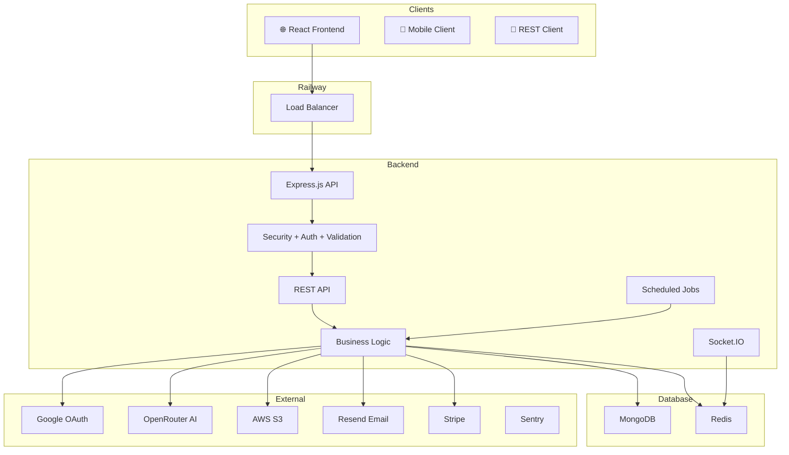

# 🚀 TaskPulse Backend

> AI-powered project management backend built with **Node.js**, **Express**, **MongoDB**, **Redis**, **Socket.IO**, and **AWS**.

TaskPulse Backend powers the TaskPulse SaaS platform by providing authentication, project management, task collaboration, analytics, AI insights, file uploads, and real-time updates through a scalable REST API.

---

## ✨ Features

- 🔐 JWT Authentication
- 👤 Google OAuth Login
- 📂 Single Workspace Architecture
- 📁 Project Management
- ✅ Task Management
- 👥 Project Collaboration & Invitations (Yet to be updated)
- 📈 Analytics Dashboard APIs
- 🤖 AI Workspace Insights
- 📎 AWS S3 File Uploads
-  📝 API Documentation (Swagger)
- 📧 Transactional Emails
- 🚨 Error Monitoring with Sentry

---

# 🏗 High-Level Architecture




---

## I would make **one more improvement**.

Instead of just a README, I'd create a `docs/` folder to make the repository feel like a professional open-source project:

```text
docs/
├── system_design.md
├── api_reference.md
├── database_schema.md
├── authentication.md
├── analytics.md
├── deployment.md
├── invitation_flow.md
└── ai_architecture.md
