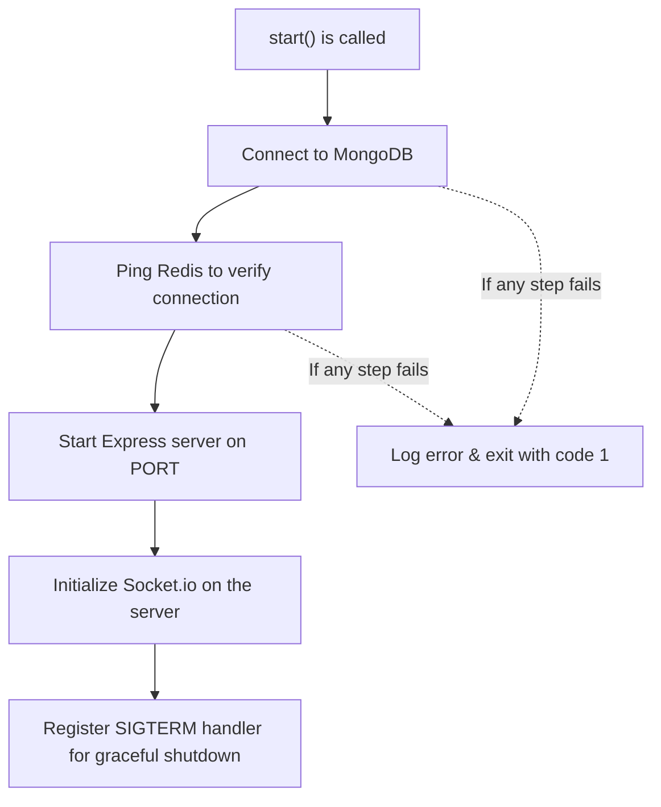
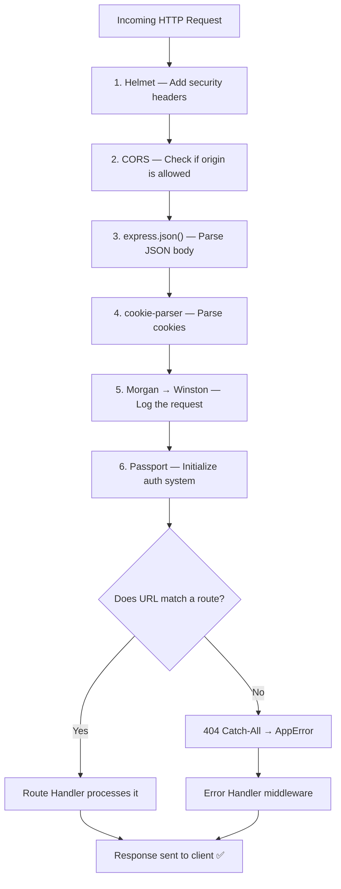
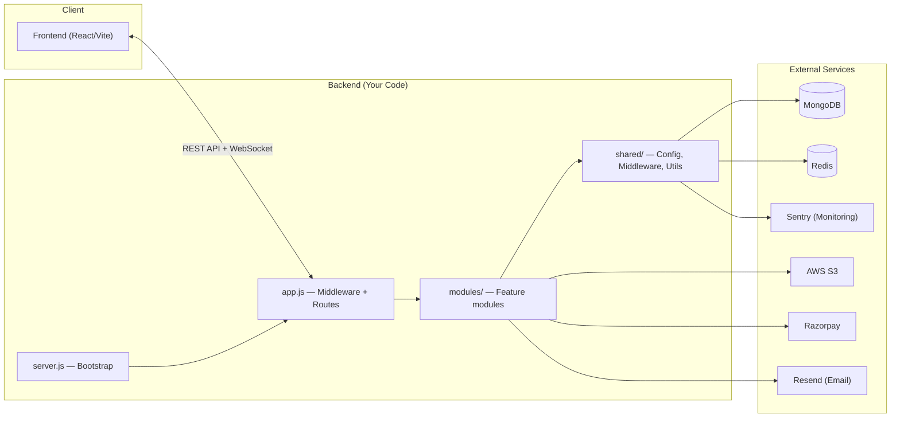

# 🎯 TaskPulse Backend — Interview Prep Guide

Good luck on Monday, Harish! Here's everything you need to confidently explain your backend.

---

## 1. Dependencies vs DevDependencies — What's the Difference?

| Aspect | `dependencies` | `devDependencies` |
|---|---|---|
| **Installed in production?** | ✅ Yes | ❌ No |
| **Purpose** | Code your app **needs to run** | Tools you need **only while developing** |
| **Install command** | `npm install <pkg>` | `npm install <pkg> --save-dev` |
| **In your project** | 17 packages | 4 packages |

> [!TIP]
> **Interview way to say it:** *"Dependencies are packages my application needs at runtime in production. DevDependencies are tools I only need during development — like testing frameworks and linters — they don't ship to production."*

---

## 2. Your Dependencies Explained (What Runs in Production)

### 🏗️ Core Framework
| Package | What It Does |
|---|---|
| **express** | The web framework. Creates the HTTP server, handles routing, middleware pipeline |
| **dotenv** | Loads environment variables from a `.env` file into `process.env` |

### 🔒 Security
| Package | What It Does |
|---|---|
| **helmet** | Sets secure HTTP headers (X-Content-Type-Options, Strict-Transport-Security, etc.) to protect against common web attacks like XSS, clickjacking |
| **cors** | Enables Cross-Origin Resource Sharing — allows your frontend (e.g., on `localhost:5173`) to call your backend API (on `localhost:3000`) |
| **bcryptjs** | Hashes passwords before storing them in the database. Uses salt rounds to make brute-force attacks impractical |
| **jsonwebtoken** | Creates and verifies JWT tokens for stateless authentication |
| **cookie-parser** | Parses cookies from incoming requests (used for refresh tokens) |
| **passport** | Authentication middleware framework — provides a strategy-based plugin system |
| **passport-google-oauth20** | Passport strategy for "Login with Google" OAuth 2.0 flow |

### 📊 Database & Caching
| Package | What It Does |
|---|---|
| **mongoose** | ODM (Object Document Mapper) for MongoDB. Defines schemas, models, and handles queries |
| **ioredis** | Redis client for Node.js. Used for caching, session management, and rate limiting |

### 📝 Logging & Monitoring
| Package | What It Does |
|---|---|
| **morgan** | HTTP request logger middleware. Logs every incoming request (method, URL, status, response time) |
| **winston** | General-purpose logging library. Supports log levels (info, error, warn), file transport, formatting |
| **@sentry/node** | Error tracking and performance monitoring. Captures unhandled errors and sends them to Sentry dashboard |

### 📚 API Documentation
| Package | What It Does |
|---|---|
| **swagger-jsdoc** | Generates OpenAPI/Swagger spec from JSDoc comments in your route files |
| **swagger-ui-express** | Serves an interactive API documentation UI at `/api-docs` |

### 💳 Payments & Communication
| Package | What It Does |
|---|---|
| **razorpay** | Indian payment gateway SDK for processing subscriptions/payments |
| **resend** | Email sending service (for invitations, notifications, password resets) |

### ☁️ Cloud Storage
| Package | What It Does |
|---|---|
| **@aws-sdk/client-s3** | AWS S3 client for file uploads (profile pictures, attachments) |
| **@aws-sdk/s3-request-presigner** | Generates pre-signed URLs so the frontend can upload directly to S3 |

### ⚡ Real-Time & Scheduling
| Package | What It Does |
|---|---|
| **socket.io** | Enables real-time bidirectional communication via WebSockets (live notifications, task updates) |
| **node-cron** | Schedules recurring jobs (e.g., daily analytics aggregation, cleanup tasks) |

### ✅ Validation
| Package | What It Does |
|---|---|
| **zod** | Schema-based runtime validation. Validates request bodies, query params before they hit your business logic |

---

## 3. Your DevDependencies Explained (Development-Only Tools)

| Package | What It Does |
|---|---|
| **nodemon** | File watcher that **auto-restarts** your server when you save a file. Used via `npm run dev` |
| **eslint** | Static code analysis. Catches bugs and enforces code style rules before runtime |
| **jest** | Testing framework. Run unit tests with `npm test` |
| **supertest** | HTTP assertion library. Lets you test API endpoints without starting a real server |

---

## 4. Key Concepts for Interview

### 🔹 What is Swagger?

> **Swagger (OpenAPI)** is a specification + toolset for documenting REST APIs.

In your project, it works in 2 steps:
1. **`swagger-jsdoc`** scans your route files (e.g., `tasks.routes.js`) for JSDoc comments like `@swagger` annotations and generates a JSON specification
2. **`swagger-ui-express`** takes that spec and renders a beautiful, **interactive UI** at `/api-docs` where anyone can see all your endpoints, try them out, and see request/response schemas

> [!TIP]
> **Interview way to say it:** *"I used Swagger to auto-generate interactive API documentation from my route comments. This gives my frontend team or any consumer a self-documenting API they can explore and test without reading my source code."*

---

### 🔹 What is Helmet?

> **Helmet** is a security middleware that sets various HTTP response headers.

It protects your app from common attacks by:
- Setting `X-Content-Type-Options: nosniff` → prevents MIME-type sniffing
- Setting `Strict-Transport-Security` → forces HTTPS
- Removing `X-Powered-By` → hides that you're using Express
- Setting `X-Frame-Options` → prevents clickjacking
- And ~11 more headers

```
One line of code:  app.use(helmet())
Adds ~15 security headers automatically.
```

> [!TIP]
> **Interview way to say it:** *"Helmet is a one-line middleware that sets around 15 secure HTTP headers to protect against common vulnerabilities like XSS, clickjacking, and MIME sniffing. It's a security best practice for any Express app."*

---

### 🔹 What is Morgan?

> **Morgan** is an HTTP request logger middleware.

Every time a request hits your server, Morgan logs it:
```
GET /api/v1/tasks 200 12ms
POST /api/v1/auth/login 401 3ms
```

In your project, Morgan's output is **piped into Winston** (your main logger), so all request logs go through the same logging pipeline and can be written to files, sent to monitoring services, etc.

```javascript
// From your app.js — Morgan writes to Winston's stream
app.use(morgan(morganFormat, { stream: { write: (msg) => logger.info(msg.trim()) } }));
```

> [!TIP]
> **Interview way to say it:** *"Morgan logs every HTTP request with method, URL, status code, and response time. I've piped it into Winston so all my logs — both request logs and application logs — go through a unified logging pipeline."*

---

### 🔹 Nodemon vs Node — What's the Difference?

This is **NOT** "nodemon vs REST API" — they are completely different things. Here's the clarification:

| Aspect | `node` (via `npm start`) | `nodemon` (via `npm run dev`) |
|---|---|---|
| **What it is** | The Node.js runtime that executes JavaScript | A **wrapper** around Node.js that watches files |
| **Behavior** | Starts your server **once**. If you change code, you must manually stop & restart | **Watches** your files. Auto-restarts the server when you save a change |
| **Used when** | **Production** — code doesn't change at runtime | **Development** — you're constantly editing code |
| **In your package.json** | `"start": "node src/server.js"` | `"dev": "nodemon src/server.js"` |

```
Production (Railway):   npm start   →  node src/server.js      (runs once, stable)
Development (local):    npm run dev →  nodemon src/server.js   (restarts on every save)
```

> [!IMPORTANT]
> **Nodemon is NOT an alternative to REST APIs.** Nodemon is a development utility. REST API is an architectural style for designing web services. They solve completely different problems.

---

## 5. The app.js and server.js Flow — Explained Like a Story

This is the most important part. Your backend follows a clean **separation of concerns** pattern:

### Why Two Files?

```
server.js  →  The "launcher" — connects to databases, starts listening
app.js     →  The "application" — defines middleware, routes, error handling
```

> [!TIP]
> **Interview way to say it:** *"I separated app configuration from server bootstrapping. This makes the app testable — in tests, I can import `app.js` and use `supertest` to send requests without actually starting a server or connecting to databases."*

---

### 📄 server.js — The Startup Sequence

Think of `server.js` as the **ignition key** of a car. It doesn't define how the engine works — it just turns everything on in the right order.



**Line-by-line flow:**

1. **Import `app`** from `app.js` — gets the fully configured Express application
2. **Import database connectors** — MongoDB (`connectDB`) and Redis
3. **Import Socket.io initializer** — for real-time features
4. **Define an async `start()` function** that:
   - Connects to MongoDB (waits for it with `await`)
   - Pings Redis to verify it's alive
   - Calls `app.listen(PORT)` to start accepting HTTP requests
   - Attaches Socket.io to the HTTP server for WebSocket support
   - Registers a `SIGTERM` handler — when Railway or Docker sends a shutdown signal, it gracefully closes connections instead of crashing
5. **If anything fails** → logs the error and exits with code 1 (tells the platform to restart)

---

### 📄 app.js — The Middleware Pipeline

Think of `app.js` as an **assembly line in a factory**. Every request passes through a series of stations in order.



**The pipeline in order:**

| Step | Code | What Happens |
|---|---|---|
| 1 | `app.use(helmet())` | Adds ~15 security headers to every response |
| 2 | `app.use(cors({...}))` | Allows requests from your frontend origin, enables cookies |
| 3 | `app.use(express.json())` | Parses incoming JSON request bodies into `req.body` |
| 4 | `app.use(cookieParser())` | Parses cookies from the `Cookie` header into `req.cookies` |
| 5 | `app.use(morgan(...))` | Logs every request (method, URL, status, time) via Winston |
| 6 | `app.use(passport.initialize())` | Sets up Passport auth strategies (Google OAuth, JWT) |
| 7 | Swagger UI at `/api-docs` | Serves interactive API documentation |
| 8 | Health checks at `/health` & `/ready` | Simple endpoints for Railway/monitoring to verify the server is alive |
| 9 | **API Routes** at `/api/v1/*` | The actual business logic — auth, tasks, workspaces, etc. |
| 10 | `app.use('*', ...)` | Catches any unmatched route and throws a 404 error |
| 11 | `app.use(errorHandler)` | **Last middleware** — catches all errors and sends a clean JSON response |

> [!IMPORTANT]
> **Order matters!** Middleware runs top-to-bottom. Helmet must run before routes (to secure responses). The error handler must be **last** (to catch errors from everything above). This is a common interview question.

---

## 6. Architecture Overview — The Big Picture



### Modular Architecture

Your project uses a **feature-based modular structure** — each feature is its own folder with its own routes, controllers, models, and services:

```
src/modules/
├── ai/           → AI-powered task suggestions
├── analytics/    → Dashboard stats & reports  
├── auth/         → Login, signup, Google OAuth, JWT
├── billing/      → Razorpay subscriptions
├── invites/      → Team invitation system
├── notifications/→ In-app + email notifications
├── projects/     → Project management
├── tasks/        → Core task CRUD
├── views/        → Custom filtered views
└── workspaces/   → Multi-tenant workspace management
```

> [!TIP]
> **Interview way to say it:** *"I followed a modular architecture where each feature — auth, tasks, billing — is a self-contained module with its own routes, controller, model, and service layer. This makes the codebase scalable — adding a new feature means adding a new folder, not touching existing code."*

---

## 7. Quick-Fire Interview Q&A

**Q: Why did you separate `app.js` and `server.js`?**
> For testability. I can import `app.js` in tests and use `supertest` to test routes without starting a real server or connecting to databases.

**Q: What's the difference between `npm start` and `npm run dev`?**
> `npm start` uses `node` — runs once, used in production. `npm run dev` uses `nodemon` — watches files and auto-restarts on changes, used in development.

**Q: Why Redis AND MongoDB?**
> MongoDB is the primary database for persistent data. Redis is an in-memory store used for caching, session management, and rate limiting — it's much faster for frequently accessed data.

**Q: What is `SIGTERM` handling?**
> When the deployment platform (Railway) wants to shut down my server, it sends a SIGTERM signal. My handler gracefully closes all connections (Redis, MongoDB, HTTP) instead of abruptly crashing, preventing data loss and dropped requests.

**Q: What is CORS and why do you need it?**
> Browsers block requests from one domain to another by default (Same-Origin Policy). Since my frontend runs on `localhost:5173` and backend on `localhost:3000`, CORS explicitly allows the frontend's origin to make API calls.

**Q: What are health check endpoints for?**
> `/health` returns a simple "ok" — used by Railway to know the server is running. `/ready` also checks MongoDB and Redis connections — used to know the server is fully ready to handle requests.

---

All the best for Monday! 🚀 You've built a production-grade backend — own it with confidence.
