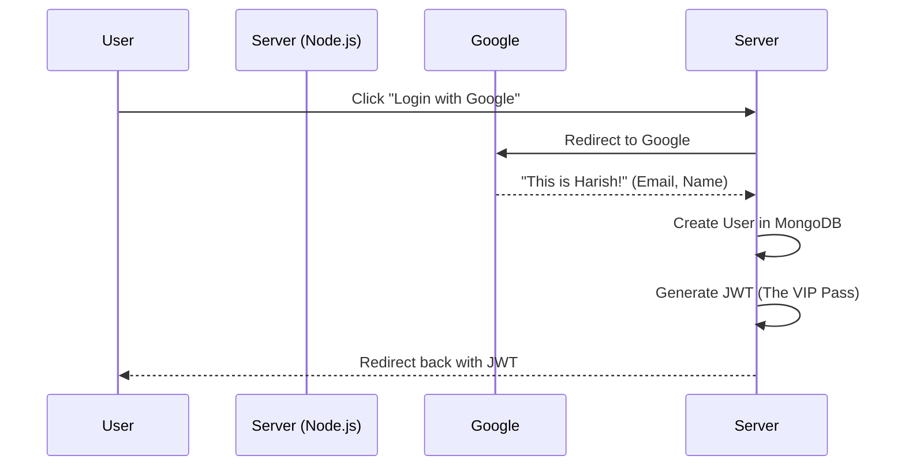
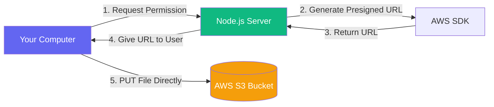

# How Our Backend APIs Work: A Step-by-Step Breakdown

Now that we have successfully built and tested the entire backend data flow, let's break down exactly what happened behind the scenes. This document will serve as your study guide for understanding modern SaaS architecture!

## 1. Authentication (Google OAuth & JWTs)
**What you did:** You clicked a link, logged into Google, and were redirected to a URL that contained a massive string of characters (your token).

**How it works:**
When you log in, Google confirms your identity and sends your email/name to our Node.js server. Our server takes that information and says, *"Okay, I know this person. Let me give them a digital ID card."* 

This digital ID card is called a **JWT** (JSON Web Token). 

> [!NOTE]
> **Why do we need this?** HTTP is "stateless", meaning it has no memory. If you ask the server for your tasks, it won't remember you logged in 5 minutes ago. You have to send your JWT in the **Authorization Header** (as a `Bearer Token`) with *every single request*.

---

## 2. Workspaces API (Multi-Tenancy)
**What you did:** You sent a `POST` request with your Bearer Token to `/api/v1/workspaces` and it created "My First Project".

**How it works:**
When the request reached our server, it went through a **Middleware Pipeline**:
1. The **Auth Middleware** looked at your Bearer Token, decrypted it, and extracted your User ID (`6a32bf...`).
2. The middleware attached your User ID to the request (`req.user.id`) and passed it to the **Controller**.
3. The Controller took your body (`{ "name": "My First Project" }`) and asked the Database (MongoDB) to create it.
4. It automatically added your User ID to the `members` array and made you the `owner`.

> [!TIP]
> **Multi-Tenancy**: By keeping data inside Workspaces, we ensure that User A can never accidentally see the tasks of User B. Every task belongs to a Workspace, and users must be members of that Workspace to see it.

---

## 3. Tasks API (Business Logic)
**What you did:** You sent another `POST` request to create a task, providing the `workspaceId` you got from the previous step.

**How it works:**
This is where **Business Logic** shines. Business logic is the code that makes your app unique (it's not just saving data to a database).
1. First, the server checks: *"Is Harish actually a member of this Workspace?"* (Security check).
2. Then, the server simulates an AI engine. It looks at your task and generates an `ai` score (Priority: 1, Urgency: High).
3. It saves the Task document in MongoDB, linking it to the `workspaceId`.

---

## 4. AWS S3 Presigned URLs (Direct Uploads)
**What you did:** You asked the server for an upload URL, and then you used Postman to send an image (`PUT`) directly to that massive URL.

**How it works:**
Normally, if a user uploads a file, it goes: `User -> Node.js Server -> AWS S3`. 
**This is bad!** If 1,000 users upload 50MB videos at the same time, your Node.js server will crash because it has to hold all those files in memory.

**The Presigned URL Solution:**
1. You ask the Node.js server: *"Can I upload a file?"*
2. Node.js asks AWS: *"Give me a temporary, 15-minute VIP pass for someone to upload a file called 'design-mockup.png' directly into my bucket."*
3. AWS generates a cryptographic signature (that massive URL) and gives it to Node.js, which gives it to you.
4. You upload the file **directly from your computer to AWS servers**. Your Node.js server never touches the file!

> [!IMPORTANT]
> **Why the AccessDenied Error happened:** AWS is incredibly secure by default. Even though Node.js had the keys to ask for a VIP pass, AWS checked the IAM Policy (Identity and Access Management) and said, *"Wait, I haven't explicitly been told this user is allowed to put objects (`s3:PutObject`) in this bucket."* Once you checked the box to attach the policy, AWS allowed the upload.

---

### Summary
By combining **Authentication** (knowing who the user is), **Relational Documents** (Workspaces and Tasks), and **Cloud Infrastructure** (AWS S3), you have built a modern, scalable backend. 

Whenever you are ready to connect this to your React frontend, or move on to the next backend module, just let me know!
