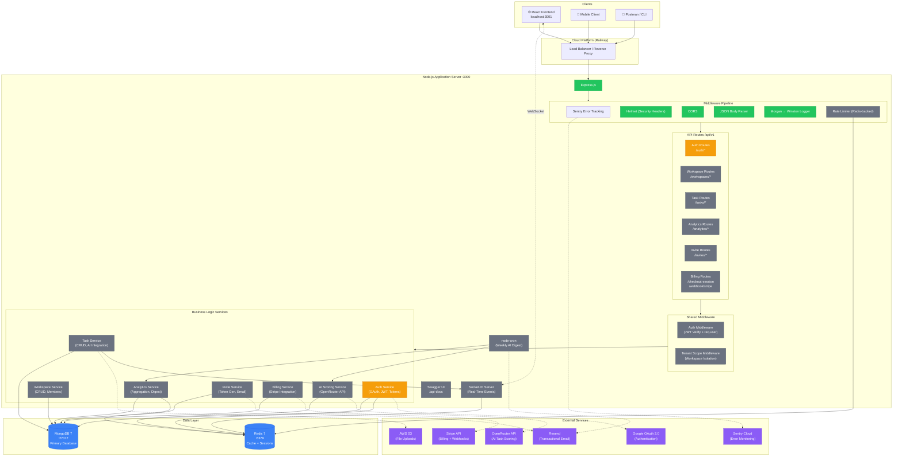
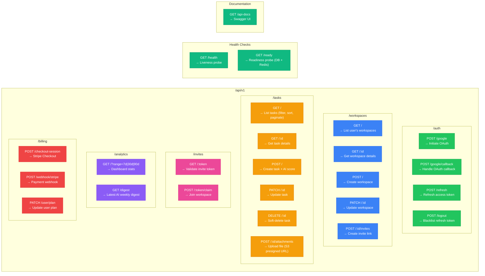
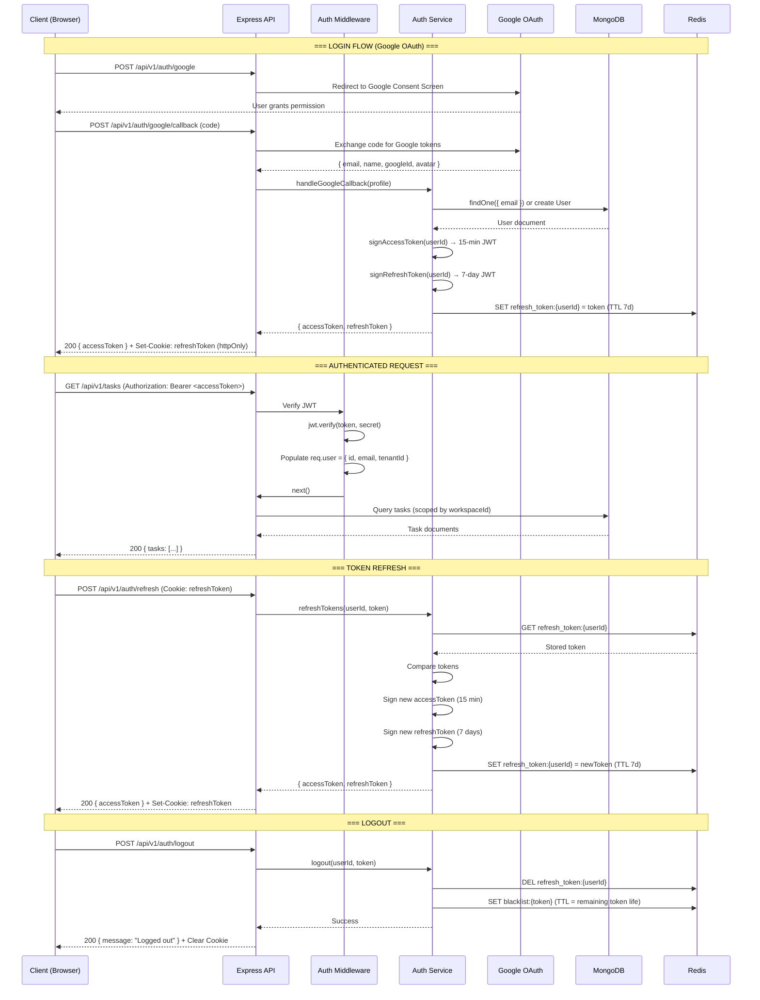
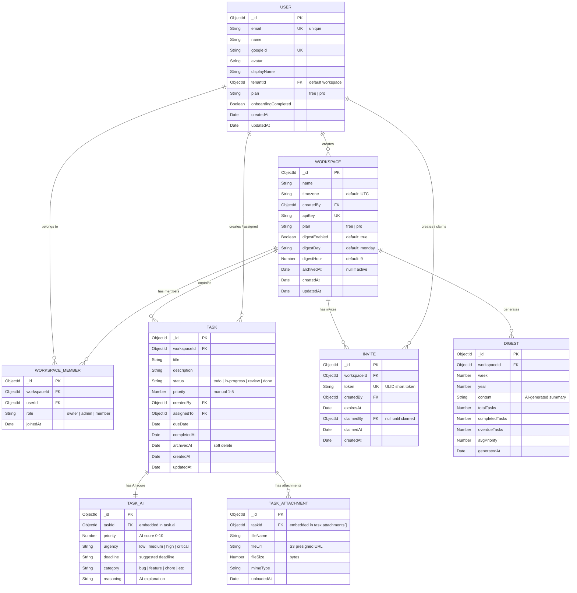
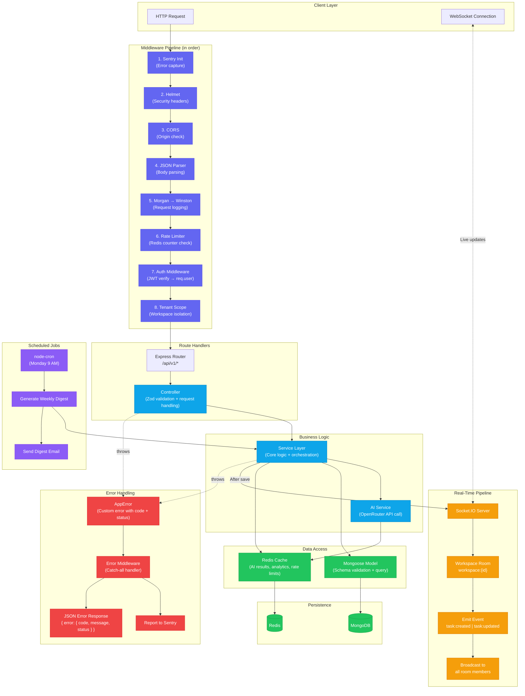
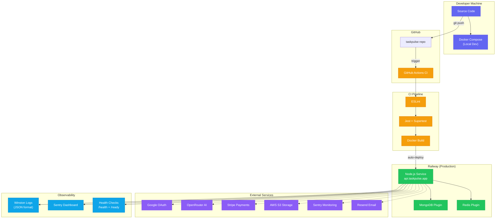

# TaskPulse — Complete System Architecture (Mermaid)

> Full intended architecture for the production-ready TaskPulse SaaS.

---

## 1. High-Level System Architecture

---

## 2. API Route Map

---

## 3. Authentication Flow

---

## 4. Data Model (Entity Relationship)

---

## 5. Request Lifecycle & Real-Time Event Flow

---

## 6. Deployment Architecture

---

## Diagram Index

| # | Diagram | What It Shows |
|---|---------|---------------|
| 1 | **High-Level System Architecture** | Every component, service, database, and external integration — the full bird's-eye view |
| 2 | **API Route Map** | All ~24 REST endpoints organized by module with HTTP methods |
| 3 | **Authentication Flow** | Step-by-step sequence: Login → Authenticated Request → Token Refresh → Logout |
| 4 | **Data Model (ER Diagram)** | All 8 MongoDB collections with fields, types, and relationships |
| 5 | **Request Lifecycle** | How a request flows through middleware → controller → service → DB → response, plus real-time events and error handling |
| 6 | **Deployment Architecture** | Dev → GitHub → CI/CD → Railway production, with all external service connections |
