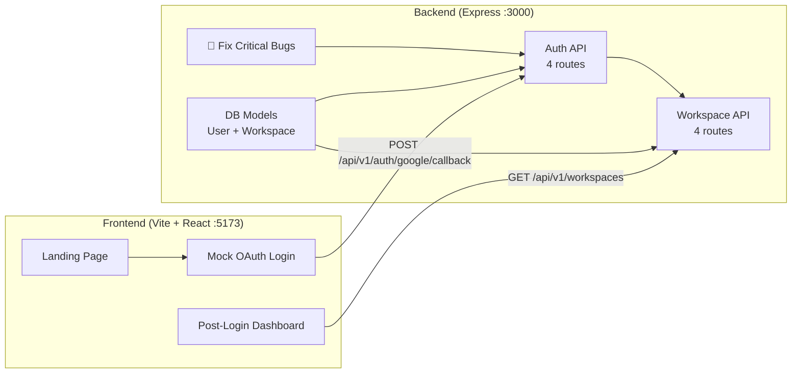

# Today's Plan — Auth Routes, Landing Page, Models & Integration

> **Date**: June 17, 2026  
> **Scope**: 4 deliverables across backend and frontend

---

## What We're Building Today



---

## Deliverable 1: Fix Critical Bugs + Auth & Workspace Routes

### Pre-requisite Fixes

#### [DELETE] [redis.client.js](file:///d:/SaaS/src/shared/utils/redis.client.js)
Delete this file entirely — it uses the wrong `redis` package and wrong env vars. All code will use the ioredis client from [redis.js](file:///d:/SaaS/src/shared/config/redis.js).

#### [MODIFY] [auth.service.js](file:///d:/SaaS/src/modules/auth/auth.service.js)
- Change `require('../../shared/utils/redis.client')` → `require('../../shared/config/redis')`
- Switch from `redisClient.setEx()` / `redisClient.get()` (node-redis API) → `redis.setex()` / `redis.get()` (ioredis API)
- Add `logout()` method — delete refresh token + blacklist it
- Use config from `env.js` instead of hardcoded `process.env`

#### [MODIFY] [.gitignore](file:///d:/SaaS/.gitignore)
Populate with standard Node.js ignore rules.

---

### Auth Routes (4 endpoints)

#### [MODIFY] [auth.routes.js](file:///d:/SaaS/src/modules/auth/auth.routes.js)
```
POST   /auth/google/callback    → Mock OAuth login (email + name in body)
POST   /auth/refresh            → Refresh access token  
POST   /auth/logout             → Blacklist refresh token
GET    /auth/me                 → Get current user profile (protected)
```

> [!NOTE]
> Keeping mock OAuth (no Passport.js) per your decision. The `/auth/google/callback` accepts `{ email, name }` in the body and simulates what Google would return. We'll add a `GET /auth/me` endpoint so the frontend can fetch the logged-in user's profile.

#### [MODIFY] [auth.controller.js](file:///d:/SaaS/src/modules/auth/auth.controller.js)
- Add `logout` handler — clears cookie + calls `authService.logout()`
- Add `getMe` handler — returns `req.user` from JWT
- Add `cookie-parser` middleware for reading refresh token cookies
- Improve error handling with `AppError`

#### [MODIFY] [auth.service.js](file:///d:/SaaS/src/modules/auth/auth.service.js)
- `generateTokens(userId)` — fixed to use ioredis
- `verifyRefreshToken(userId, token)` — fixed to use ioredis  
- `logout(userId)` — **new** — deletes refresh token from Redis
- `verifyAccessToken(token)` — **new** — decodes JWT, returns payload

#### [NEW] [auth.middleware.js](file:///d:/SaaS/src/shared/middleware/auth.middleware.js)
- Extract JWT from `Authorization: Bearer <token>` header
- Verify token with `jwt.verify()`
- Populate `req.user = { id, email }`
- Return 401 if missing/invalid

---

### Workspace Routes (4 endpoints)

#### [NEW] [workspaces.routes.js](file:///d:/SaaS/src/modules/workspaces/workspaces.routes.js)
```
GET    /workspaces              → List user's workspaces (protected)
GET    /workspaces/:id          → Get workspace by ID (protected)
POST   /workspaces              → Create workspace (protected)
PATCH  /workspaces/:id          → Update workspace (protected, owner only)
```

#### [NEW] [workspaces.controller.js](file:///d:/SaaS/src/modules/workspaces/workspaces.controller.js)
- `listWorkspaces` — find where user is a member
- `getWorkspace` — find by ID, verify membership
- `createWorkspace` — create + auto-add current user as owner
- `updateWorkspace` — verify ownership, apply partial update

#### [NEW] [workspaces.service.js](file:///d:/SaaS/src/modules/workspaces/workspaces.service.js)
- CRUD operations calling the Workspace model
- Member management helpers

---

### Wire Routes in App

#### [MODIFY] [app.js](file:///d:/SaaS/src/app.js)
- Uncomment auth routes line + add workspace routes
- Add `cookie-parser` middleware (needed for refresh token cookies)
- Ensure proper route prefixing: `/api/v1/auth/*`, `/api/v1/workspaces/*`

---

## Deliverable 2: Landing Page + Login Flow

### Frontend Setup

#### [NEW] `client/` directory — Vite + React app
Using `npx create-vite` for a lightweight, fast React setup.

**Pages/Components:**
| Component | Purpose |
|-----------|---------|
| `LandingPage` | Hero section, features showcase, CTA to login |
| `LoginPage` | Mock Google OAuth button → calls backend |
| `DashboardPage` | Post-login view showing user's workspaces |
| `Navbar` | Auth-aware navigation (login/logout) |

**Design Approach:**
- Dark theme with gradient accents (premium SaaS feel)
- Glass morphism cards for feature highlights
- Smooth animations on scroll and hover
- Google Fonts: Inter for body, Outfit for headings
- Responsive (mobile-first)

**Auth Flow:**
```
1. User lands on "/" → sees landing page with "Get Started" button
2. Clicks "Get Started" → navigated to "/login"
3. Login page has a "Sign in with Google" button
4. Since we're mocking: user enters email + name in a form
5. Frontend calls POST /api/v1/auth/google/callback { email, name }
6. Backend returns { accessToken, user } + sets refreshToken cookie
7. Frontend stores accessToken in memory, redirects to "/dashboard"
8. Dashboard calls GET /api/v1/workspaces with Bearer token
9. Shows user's workspaces (auto-created on first login)
```

---

## Deliverable 3: DB Models

#### [MODIFY] [auth.model.js](file:///d:/SaaS/src/modules/auth/auth.model.js) → User Model
```javascript
{
  email,              // String, required, unique
  name,               // String (replaces displayName)
  googleId,           // String, sparse unique
  avatar,             // String (URL)
  plan,               // "free" | "pro", default "free"
  onboardingCompleted // Boolean, default false
  // timestamps: createdAt, updatedAt (auto)
}
```

> [!IMPORTANT]
> **Breaking change**: Removing `tenantId` from User model. The sprint plan uses a `members[]` array on Workspace to track membership, not a foreign key on User. This is better for multi-workspace support (a user can belong to many workspaces).

#### [MODIFY] [workspaces.model.js](file:///d:/SaaS/src/modules/workspaces/workspaces.model.js) → Workspace Model
```javascript
{
  name,               // String, required
  timezone,           // String, default "UTC"
  createdBy,          // ObjectId ref User
  members: [{         // Array of members
    userId,           // ObjectId ref User
    role              // "owner" | "admin" | "member"
  }],
  settings: {
    digestEnabled,    // Boolean, default true
    digestDay,        // String, default "monday"
    digestHour        // Number, default 9
  },
  apiKey,             // String, unique sparse
  plan,               // "free" | "pro", default "free"
  archivedAt          // Date, null if active
  // timestamps: createdAt, updatedAt (auto)
}
```
- Index: `{ createdBy: 1 }`
- Index: `{ "members.userId": 1 }`

---

## Deliverable 4: Frontend ↔ Backend Integration

#### [MODIFY] [app.js](file:///d:/SaaS/src/app.js)
- Update CORS origin to allow `http://localhost:5173` (Vite dev server)
- Enable `credentials: true` in CORS config (for cookies)

#### Frontend API Layer
- Create `client/src/api/` with axios instance
- Base URL: `http://localhost:3000/api/v1`
- Auto-attach `Authorization: Bearer <token>` header
- Interceptor for 401 → redirect to login

#### Testing Checklist
- [ ] Backend starts cleanly on port 3000
- [ ] `POST /api/v1/auth/google/callback` → returns tokens + creates user
- [ ] `GET /api/v1/auth/me` → returns user profile (with Bearer token)
- [ ] `POST /api/v1/auth/logout` → clears session
- [ ] `GET /api/v1/workspaces` → returns user's workspaces
- [ ] Frontend landing page renders at `localhost:5173`
- [ ] Login flow works end-to-end
- [ ] Dashboard shows workspace created during signup

---

## New Dependencies Required

### Backend
```bash
npm install cookie-parser   # Parse refresh token from cookies
```

### Frontend  
```bash
npx create-vite client --template react  # Scaffold React app
cd client && npm install
npm install axios react-router-dom       # HTTP client + routing
```

---

## Files Summary

| Action | File | Component |
|--------|------|-----------|
| 🗑️ DELETE | `src/shared/utils/redis.client.js` | Broken Redis client |
| ✏️ MODIFY | `src/modules/auth/auth.model.js` | User schema redesign |
| ✏️ MODIFY | `src/modules/workspaces/workspaces.model.js` | Workspace schema expansion |
| ✏️ MODIFY | `src/modules/auth/auth.service.js` | Fix Redis + add logout |
| ✏️ MODIFY | `src/modules/auth/auth.controller.js` | Add logout + getMe |
| ✏️ MODIFY | `src/modules/auth/auth.routes.js` | Add logout + me routes |
| ✏️ MODIFY | `src/app.js` | Wire routes + cookie-parser + CORS |
| ✏️ MODIFY | `.gitignore` | Populate ignore rules |
| 🆕 NEW | `src/shared/middleware/auth.middleware.js` | JWT verification |
| 🆕 NEW | `src/modules/workspaces/workspaces.routes.js` | Workspace endpoints |
| 🆕 NEW | `src/modules/workspaces/workspaces.controller.js` | Workspace handlers |
| 🆕 NEW | `src/modules/workspaces/workspaces.service.js` | Workspace business logic |
| 🆕 NEW | `client/` | Entire Vite + React frontend |

---

## Verification Plan

### Backend Verification
```bash
# Start Docker databases
docker-compose up -d mongo redis

# Start backend
npm run dev

# Test auth endpoints with curl
curl -X POST http://localhost:3000/api/v1/auth/google/callback \
  -H "Content-Type: application/json" \
  -d '{"email":"test@test.com","name":"Test User"}'

# Test protected route
curl http://localhost:3000/api/v1/auth/me \
  -H "Authorization: Bearer <token_from_above>"

# Test workspaces
curl http://localhost:3000/api/v1/workspaces \
  -H "Authorization: Bearer <token_from_above>"
```

### Frontend Verification
```bash
cd client && npm run dev
# Open http://localhost:5173
# Click "Get Started" → Login → See Dashboard
```

### End-to-End Flow
1. Land on `localhost:5173` → premium landing page
2. Click login → enter mock credentials
3. Backend creates user + workspace → returns token
4. Redirect to dashboard → workspace visible
5. Logout → token cleared → back to landing
