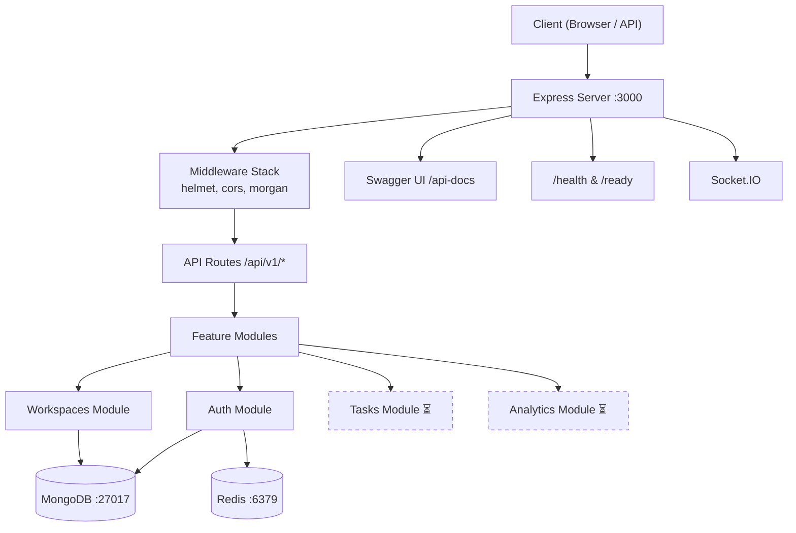

# TaskPulse SaaS — Project Documentation

> **AI-powered Task Management SaaS** built with Node.js, Express, MongoDB, Redis, and Docker.

---

## Table of Contents

- [Project Architecture](#project-architecture)
- [Folder Structure & File Explanations](#folder-structure--file-explanations)
- [Bugs Fixed During Setup](#bugs-fixed-during-setup)
- [How to Run](#how-to-run)
- [Available Endpoints](#available-endpoints)
- [Environment Variables](#environment-variables)

---

## Project Architecture



> [!NOTE]
> Dashed modules (Tasks, Analytics) are scaffolded but not yet implemented.

---

## Folder Structure & File Explanations

```
d:\SaaS\
├── .env                        # Environment variables (local dev)
├── .gitignore                  # Git ignore rules
├── Dockerfile                  # Docker image definition
├── docker-compose.yml          # Multi-container orchestration
├── package.json                # Dependencies & scripts
├── package-lock.json           # Locked dependency tree
├── logs/                       # Application log files (auto-created)
│
└── src/
    ├── server.js               # Entry point — bootstraps DB, Redis, starts listening
    ├── app.js                  # Express app — middleware, routes, error handling
    │
    ├── shared/                 # Shared infrastructure (used across all modules)
    │   ├── config/
    │   │   ├── env.js          # Environment variable loader & validator
    │   │   ├── db.js           # MongoDB connection via Mongoose
    │   │   └── redis.js        # Redis connection via ioredis
    │   ├── middleware/
    │   │   ├── auth.middleware.js       # JWT authentication guard
    │   │   ├── error.middleware.js      # Express error middleware
    │   │   └── rateLimit.middleware.js  # Rate limiting
    │   └── utils/
    │       ├── AppError.js       # Custom error class with status & code
    │       ├── errorHandler.js   # Global error handler (logs + JSON response)
    │       ├── logger.js         # Winston logger with console + file transports
    │       ├── redis.client.js   # Alternative Redis client utility
    │       └── response.js       # Standardized response helper
    │
    ├── modules/                # Feature modules (domain-driven)
    │   ├── auth/
    │   │   ├── auth.model.js       # User Mongoose schema
    │   │   ├── auth.service.js     # Business logic (register, login, tokens)
    │   │   ├── auth.controller.js  # Route handlers
    │   │   └── auth.routes.js      # Express router definitions
    │   ├── workspaces/
    │   │   └── workspaces.model.js # Workspace Mongoose schema
    │   ├── tasks/                  # ⏳ Scaffolded, not yet implemented
    │   └── analytics/              # ⏳ Scaffolded, not yet implemented
    │
    └── websocket/
        └── socket.js           # Socket.IO setup for real-time features
```

---

### Root Files

| File | Purpose |
|------|---------|
| [.env](file:///d:/SaaS/.env) | Local environment variables. Contains connection strings, API keys, JWT secrets. **Never commit to git.** |
| [Dockerfile](file:///d:/SaaS/Dockerfile) | Builds a `node:18-alpine` production image. Copies only `package*.json` first (for layer caching), then `src/`. Includes a health check hitting `/health`. |
| [docker-compose.yml](file:///d:/SaaS/docker-compose.yml) | Orchestrates 3 services: **MongoDB 7**, **Redis 7**, and the **Node.js app**. The app waits for both databases to be healthy before starting. |
| [package.json](file:///d:/SaaS/package.json) | Defines project metadata, npm scripts (`dev`, `start`, `test`, `docker:*`), and all dependencies. |

---

### Source Files — Detailed Breakdown

#### Entry Points

##### [server.js](file:///d:/SaaS/src/server.js)
The application's **bootstrap file**. It:
1. Connects to MongoDB via `connectDB()`
2. Pings Redis to verify connectivity
3. Starts the Express HTTP server on the configured `PORT`
4. Registers a `SIGTERM` handler for graceful shutdown (closes server, disconnects Redis)

##### [app.js](file:///d:/SaaS/src/app.js)
The **Express application** definition. Configures the middleware pipeline in order:
1. **Helmet** — sets security HTTP headers
2. **CORS** — allows cross-origin requests from the configured frontend origin
3. **JSON parser** — parses `application/json` request bodies
4. **Morgan** — HTTP request logging, piped through Winston
5. **Swagger UI** — auto-generated API docs at `/api-docs`
6. **Health endpoints** — `/health` (liveness) and `/ready` (readiness with DB pings)
7. **Feature routes** — currently commented out, ready to wire up
8. **404 catch-all** — returns structured error for unknown routes
9. **Error handler** — last middleware, formats all errors as JSON

---

#### Shared Config

##### [env.js](file:///d:/SaaS/src/shared/config/env.js)
Loads `.env` via `dotenv`, validates that required variables exist (`JWT_SECRET`, `MONGODB_URI`, `REDIS_URL`, `GOOGLE_CLIENT_ID`, `GOOGLE_CLIENT_SECRET`), and exports a typed config object with defaults.

##### [db.js](file:///d:/SaaS/src/shared/config/db.js)
Exports `connectDB()` — connects to MongoDB using Mongoose. Also exports the `mongoose` instance so other modules can access `mongoose.connection` for health checks.

##### [redis.js](file:///d:/SaaS/src/shared/config/redis.js)
Creates an **ioredis** client with lazy connection and exponential retry strategy. Logs connection/error events via Winston. Connects immediately on import.

---

#### Shared Utils

##### [AppError.js](file:///d:/SaaS/src/shared/utils/AppError.js)
Custom `Error` subclass adding `status` (HTTP code), `code` (error identifier like `INTERNAL_SERVER_ERROR`), and `timestamp`. Preserves clean stack traces via `Error.captureStackTrace`.

##### [errorHandler.js](file:///d:/SaaS/src/shared/utils/errorHandler.js)
Express error-handling middleware (4 arguments: `err, req, res, next`). Logs the error with Winston and returns a structured JSON response:
```json
{
  "error": {
    "code": "INTERNAL_SERVER_ERROR",
    "message": "Something went wrong",
    "status": 500,
    "timestamp": "2026-06-14T...",
    "requestId": "unknown"
  }
}
```

##### [logger.js](file:///d:/SaaS/src/shared/utils/logger.js)
Configures **Winston** with two transports:
- **Console** — colorized, human-readable format
- **File** — JSON format, rotated at 10MB, keeps 5 files

Also exports a Morgan format string for HTTP request logging.

---

#### Feature Modules

##### Auth Module ([src/modules/auth/](file:///d:/SaaS/src/modules/auth))
| File | Role |
|------|------|
| `auth.model.js` | Mongoose schema for users (email, password hash, OAuth data) |
| `auth.service.js` | Business logic — password hashing, JWT generation, token verification |
| `auth.controller.js` | Express request handlers — register, login, refresh token |
| `auth.routes.js` | Router definitions (`POST /register`, `POST /login`, etc.) |

##### Workspaces Module ([src/modules/workspaces/](file:///d:/SaaS/src/modules/workspaces))
Contains only `workspaces.model.js` — a Mongoose schema for team workspaces. Controller, service, and routes are not yet created.

##### Tasks & Analytics
Scaffolded as empty directories, awaiting implementation.

---

#### Docker Setup

##### [Dockerfile](file:///d:/SaaS/Dockerfile)
```dockerfile
FROM node:18-alpine          # Lightweight base image
WORKDIR /app
COPY package*.json ./        # Install deps first (layer cache)
RUN npm ci --only=production
COPY src ./src               # Copy source code
EXPOSE 3000
HEALTHCHECK ...              # Hits /health every 30s
CMD ["node", "src/server.js"]
```

##### [docker-compose.yml](file:///d:/SaaS/docker-compose.yml)

| Service | Image | Port | Purpose |
|---------|-------|------|---------|
| `mongo` | `mongo:7` | 27017 | Primary database |
| `redis` | `redis:7-alpine` | 6379 | Caching, sessions, rate limiting |
| `app` | Built from Dockerfile | 3000 | The Node.js application |

> [!IMPORTANT]
> The `app` service overrides `MONGODB_URI` and `REDIS_URL` with Docker service names (`mongo`, `redis`). When running locally with `npm run dev`, the `.env` file uses `localhost` instead.

---

## Bugs Fixed During Setup

### 1. `jsonwebtoken` — Non-existent Version

| | |
|---|---|
| **Error** | `npm error notarget No matching version found for jsonwebtoken@^9.1.2` |
| **Root Cause** | Version `9.1.2` doesn't exist on npm. The latest is `9.0.3`. |
| **Fix** | Changed `"jsonwebtoken": "^9.1.2"` → `"^9.0.3"` in [package.json](file:///d:/SaaS/package.json) |

---

### 2. `sentry` — Wrong Package Name

| | |
|---|---|
| **Error** | `npm error notarget No matching version found for sentry@^7.91.0` |
| **Root Cause** | The package `sentry` doesn't exist. Sentry's Node.js SDK is published as `@sentry/node`. |
| **Fix** | Changed `"sentry": "^7.91.0"` → `"@sentry/node": "^8.0.0"` in [package.json](file:///d:/SaaS/package.json) |

---

### 3. Docker MongoDB — Corrupted Volume (Exit Code 62)

| | |
|---|---|
| **Error** | `Container taskpulse_mongo Error` — exit code 62 |
| **Root Cause** | A stale `mongo_data` Docker volume from a previous (incompatible) MongoDB instance was being mounted. MongoDB detected data corruption and refused to start. |
| **Fix** | Ran `docker-compose down -v` to remove the old volumes, then renamed containers from `taskpulse_*` → `saas_*`. Also removed the deprecated `version: '3.8'` key from [docker-compose.yml](file:///d:/SaaS/docker-compose.yml). |

---

### 4. `errorHandler` — Wrong Import Path

| | |
|---|---|
| **Error** | `Cannot find module './shared/middleware/errorHandler'` |
| **Root Cause** | [app.js](file:///d:/SaaS/src/app.js) line 9 imported from `./shared/middleware/errorHandler`, but the file is located at `./shared/utils/errorHandler`. |
| **Fix** | Changed the import path to `./shared/utils/errorHandler` |

---

### 5. `/ready` Endpoint — Stale `null` Connection Export

| | |
|---|---|
| **Error** | `/ready` returned `503 Service not ready` even with databases running |
| **Root Cause** | In [db.js](file:///d:/SaaS/src/shared/config/db.js), `connection` was exported as `null` at module load time. `module.exports = { connection }` captures the **value** at export time, not a live reference. After `connectDB()` reassigned the local variable, the export remained `null`. |
| **Fix** | Removed the `connection` variable. Export `mongoose` directly and use `mongoose.connection` (a live getter) in the `/ready` endpoint. Also removed deprecated `useNewUrlParser` and `useUnifiedTopology` Mongoose options. |

```diff
 // db.js — Before
-let connection = null;
-connection = await mongoose.connect(uri, { useNewUrlParser: true, useUnifiedTopology: true });
-module.exports = { connectDB, connection, mongoose };

 // db.js — After
+await mongoose.connect(uri);
+module.exports = { connectDB, mongoose };

 // app.js — /ready endpoint
-await db.connection.db.admin().ping();
+await mongoose.connection.db.admin().ping();
```

---

## How to Run

### Local Development (recommended for active coding)

```powershell
# 1. Start databases in Docker
docker-compose up -d mongo redis

# 2. Run the app with hot-reload
npm run dev
```

> [!TIP]
> When running locally, `.env` uses `localhost` for database connections. Docker Compose overrides these with service names for containerized deployment.

### Full Docker Stack

```powershell
# Start everything (builds app image + databases)
docker-compose up -d

# View logs
docker-compose logs -f app

# Stop and remove (add -v to also delete data volumes)
docker-compose down
```

---

## Available Endpoints

| Method | Path | Description |
|--------|------|-------------|
| `GET` | `/health` | Liveness check — returns `{ status: "ok" }` |
| `GET` | `/ready` | Readiness check — pings MongoDB & Redis |
| `GET` | `/api-docs` | Swagger UI — interactive API documentation |

> [!NOTE]
> Auth, workspace, task, and analytics routes are defined but not yet wired up in [app.js](file:///d:/SaaS/src/app.js#L57-L61). Uncomment them as you implement each module.

---

## Environment Variables

| Variable | Required | Default | Description |
|----------|----------|---------|-------------|
| `NODE_ENV` | No | `development` | Runtime environment |
| `PORT` | No | `3000` | Server port |
| `API_URL` | No | `http://localhost:3000` | Base URL for Swagger |
| `MONGODB_URI` | **Yes** | — | MongoDB connection string |
| `REDIS_URL` | **Yes** | — | Redis connection string |
| `JWT_SECRET` | **Yes** | — | Secret for signing JWTs |
| `JWT_ACCESS_EXPIRES_IN` | No | `900` (15 min) | Access token TTL in seconds |
| `JWT_REFRESH_EXPIRES_IN` | No | `604800` (7 days) | Refresh token TTL in seconds |
| `GOOGLE_CLIENT_ID` | **Yes** | — | Google OAuth client ID |
| `GOOGLE_CLIENT_SECRET` | **Yes** | — | Google OAuth client secret |
| `GOOGLE_CALLBACK_URL` | No | — | OAuth callback URL |
| `OPENROUTER_API_KEY` | No | — | AI model API key |
| `OPENROUTER_MODEL` | No | `mistralai/mistral-7b-instruct` | AI model selection |
| `SENTRY_DSN` | No | — | Sentry error tracking DSN |
| `LOG_LEVEL` | No | `info` | Winston log level |
| `LOG_FILE` | No | `logs/app.log` | Log file path |
| `CORS_ORIGIN` | No | `http://localhost:3001` | Allowed CORS origin |
