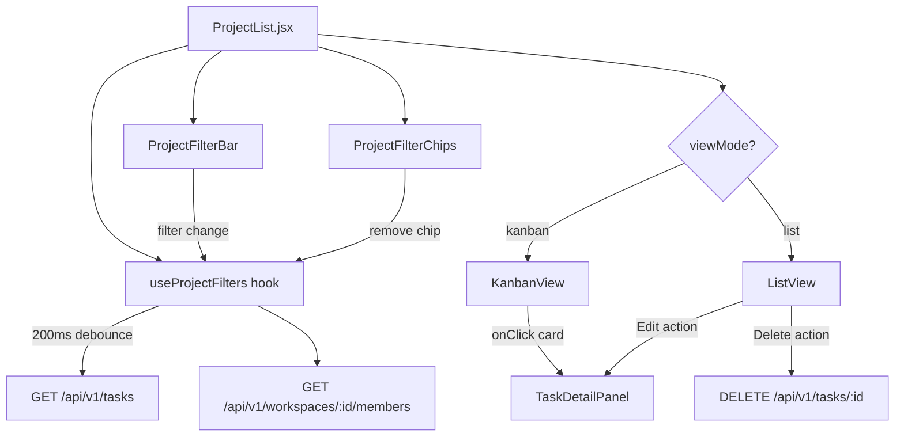

# Dynamic Projects Page — Implementation Plan

Fully rebuild the `ProjectList` component from a static mock-data table into a dynamic, API-driven task management page with five filters, filter chips, Kanban + List views, pagination, and delete support.

---

## User Review Required

> [!IMPORTANT]
> The existing `ProjectList.jsx` is a mock-data project table (projects with health/lead/progress). The new requirements describe a **task-centric** page (status/priority/category/assignee on tasks, not projects). This plan **replaces the project table with a task-based filtered view**, which aligns with the API (`GET /api/v1/tasks`). The "Projects" route will become a task browser with rich filtering.

> [!WARNING]
> The backend `listTasks` service currently supports `status`, `priority`, `assignedTo`, `createdBy`, `page`, `limit`, and `sort` query params. It does **not** support `category`, `from`/`to` date range, or `search` text on the server side. The frontend will send these params for future backend support, but category will use `ai.category` client-side filtering for now, and date range will filter `dueDate` client-side.

---

## Proposed Changes

### shadcn/ui Components to Install

We need `select`, `popover`, `calendar`, `skeleton`, `table`, `checkbox`, `dropdown-menu`, and `separator`. Some may already exist.

```bash
npx shadcn@latest add select popover calendar skeleton table checkbox dropdown-menu separator --yes
```

---

### Projects Component — Complete Rewrite

#### [MODIFY] [ProjectList.jsx](file:///d:/SaaS/sample/sample-design/src/components/projects/ProjectList.jsx)

Complete rewrite. This becomes the shell that:
- Manages all filter state (`status`, `priority`, `category`, `assignee`, `dateRange`)
- Fetches members from `GET /api/v1/workspaces/:id/members`
- Debounced fetch tasks from `GET /api/v1/tasks?workspaceId=:id&status=&...&limit=20&offset=0`
- Manages `viewMode` (kanban/list) persisted in `localStorage`
- Manages pagination (offset-based "Load more")
- Shows filter chips + "Clear all" button
- Renders either `<KanbanView>` or `<ListView>` based on toggle

**Key state:**
```js
const [filters, setFilters] = useState({ status: 'all', priority: 'any', category: 'any', assignee: 'any', dateFrom: null, dateTo: null });
const [tasks, setTasks] = useState([]);
const [members, setMembers] = useState([]);
const [viewMode, setViewMode] = useState(localStorage.getItem('tp-view-mode') || 'kanban');
const [loading, setLoading] = useState(true);
const [offset, setOffset] = useState(0);
const [total, setTotal] = useState(0);
const [editingTask, setEditingTask] = useState(null);
```

---

#### [NEW] [ProjectFilterBar.jsx](file:///d:/SaaS/sample/sample-design/src/components/projects/ProjectFilterBar.jsx)

Horizontal filter bar with five selectors + "Clear all":

| Filter | Component | Options |
|--------|-----------|---------|
| Status | shadcn `Select` | All · Todo · In Progress · Review · Done |
| Priority | shadcn `Select` | Any · High (7-10) · Medium (4-6) · Low (1-3) |
| Category | shadcn `Select` | Any · Bug · Feature · Chore · Research |
| Assignee | shadcn `Select` | Any · (populated from members API) |
| Date Range | Custom `Popover` + `Calendar` | From/To date pickers |

Plus a "Clear all" ghost button on the right.

---

#### [NEW] [ProjectFilterChips.jsx](file:///d:/SaaS/sample/sample-design/src/components/projects/ProjectFilterChips.jsx)

Renders below the filter bar. For each active filter (non-default value), shows a chip:
- `[Status: In Progress ×]` `[Priority: High ×]` `[Riya ×]`
- Clicking `×` resets that specific filter to its default and triggers a re-fetch

---

#### [NEW] [KanbanView.jsx](file:///d:/SaaS/sample/sample-design/src/components/projects/KanbanView.jsx)

Four columns: **Todo · In Progress · Review · Done**

Each column:
- Header: status label + count badge
- Cards: task title, AI priority badge (coloured), category badge, assignee avatar, due date
- Clicking a card calls `onEditTask(taskId)` → opens `TaskDetailPanel`

Uses existing CSS patterns (`tp-*` classes) + new `tp-kanban-*` classes.

---

#### [NEW] [ListView.jsx](file:///d:/SaaS/sample/sample-design/src/components/projects/ListView.jsx)

Full table with sortable columns:

| Column | Sortable | Notes |
|--------|----------|-------|
| Checkbox | No | For future bulk actions |
| Title | Yes | Task title, bold |
| Status | Yes | Status badge (existing `TaskStatusBadge`) |
| Priority | Yes | AI priority number badge |
| Category | Yes | Badge from `ai.category` |
| Assignee | Yes | Avatar + name |
| Due Date | Yes | Formatted date |
| Actions | No | Edit (→ drawer) + Delete (confirm then `DELETE /tasks/:id`) |

Uses shadcn `Table`, `Checkbox`, `DropdownMenu` for row actions. Sorting is client-side on the already-fetched page of results.

---

### Custom Hook

#### [NEW] [useProjectFilters.js](file:///d:/SaaS/sample/sample-design/src/hooks/useProjectFilters.js)

Custom hook encapsulating:
- Filter state management
- Debounced API call (200ms via existing `useDebounce` hook)
- Pagination state (offset, total, hasMore)
- `fetchTasks()`, `loadMore()`, `resetFilters()` functions
- Members fetch from workspace API

This keeps `ProjectList.jsx` clean and focused on rendering.

---

### Styles

#### [NEW] [projects.css](file:///d:/SaaS/sample/sample-design/src/styles/projects.css)

New CSS file for:
- `.tp-projects-header` — top bar with title + view toggle
- `.tp-projects-filters` — horizontal filter bar layout
- `.tp-projects-chips` — filter chips row
- `.tp-kanban-board` — flexbox four-column layout
- `.tp-kanban-column` — individual column
- `.tp-kanban-card` — task cards with hover effects
- `.tp-kanban-column-header` — column header with count
- `.tp-list-actions` — action buttons in table rows
- `.tp-view-toggle` — list/kanban toggle button group
- Skeleton loading states

Import in `DashboardLayout.jsx`.

---

### Layout Update

#### [MODIFY] [DashboardLayout.jsx](file:///d:/SaaS/sample/sample-design/src/layouts/DashboardLayout.jsx)

- Add `import '../../src/styles/projects.css';`

---

## Architecture Flow



---

## File Summary

| File | Action | Purpose |
|------|--------|---------|
| `ProjectList.jsx` | MODIFY | Shell: filters, views, pagination, loading |
| `ProjectFilterBar.jsx` | NEW | Five filter selects + clear all |
| `ProjectFilterChips.jsx` | NEW | Active filter chip badges |
| `KanbanView.jsx` | NEW | Four-column kanban board |
| `ListView.jsx` | NEW | Sortable table with actions |
| `useProjectFilters.js` | NEW | Filter state + debounced API hook |
| `projects.css` | NEW | All project-page styles |
| `DashboardLayout.jsx` | MODIFY | Import new CSS |

---

## Verification Plan

### Automated Tests
- `npm run build` — verify zero build errors after all changes

### Manual Verification
- Open `/dashboard/projects` and verify:
  - [ ] All five filters render and change filter state
  - [ ] Active filter chips appear below filter bar and are removable
  - [ ] "Clear all" resets everything
  - [ ] Kanban shows four columns with task cards
  - [ ] List shows sortable table with working sort arrows
  - [ ] View toggle switches between views and persists to localStorage
  - [ ] Empty state shows when no tasks match filters
  - [ ] Delete works with confirmation dialog
  - [ ] "Load more" pagination appends tasks
  - [ ] Clicking a task opens TaskDetailPanel drawer
